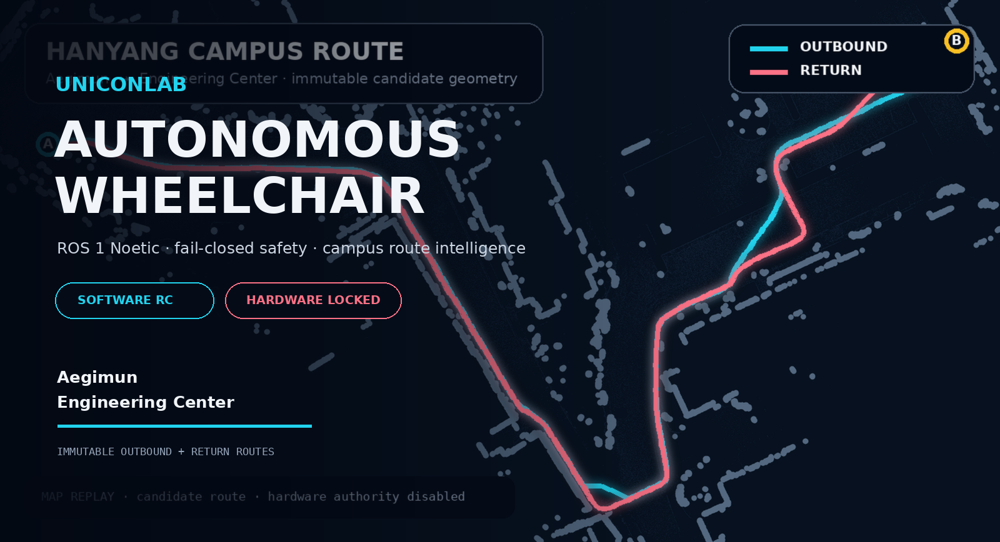
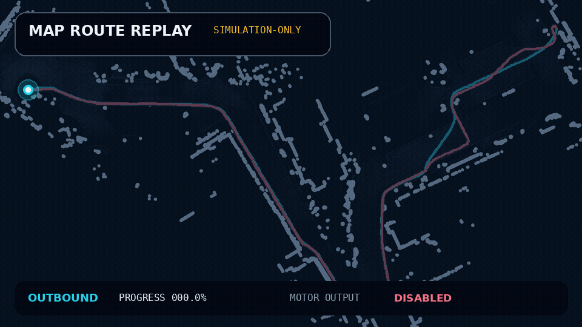
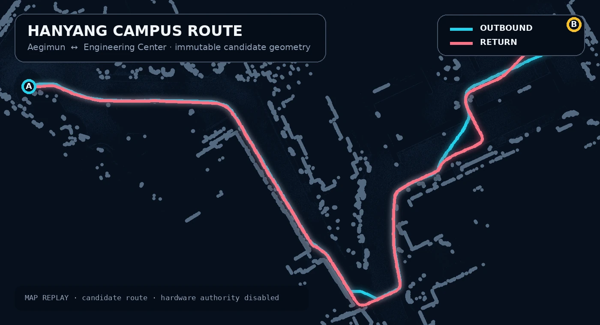
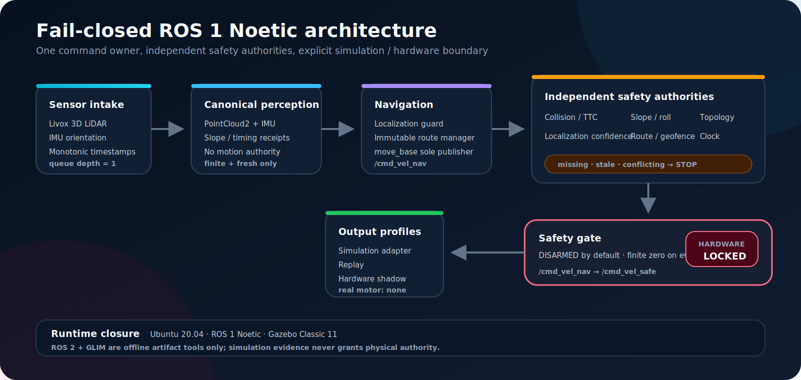

<p align="center">
  
</p>

<h1 align="center">UniconLab Autonomous Wheelchair</h1>

<p align="center">
  A fail-closed ROS 1 Noetic software stack for campus-route perception, localization,
  navigation, mission control, and independent motion-safety supervision.
</p>

<p align="center">
  <a href="http://wiki.ros.org/noetic"></a>
  <a href="https://releases.ubuntu.com/20.04/"></a>
  <a href="https://classic.gazebosim.org/"></a>
  
  
  <a href="LICENSE"></a>
</p>

<p align="center">
  <a href="#overview">Overview</a> ·
  <a href="#visual-route-replay">Route replay</a> ·
  <a href="#architecture">Architecture</a> ·
  <a href="#quick-start">Quick start</a> ·
  <a href="#verification">Verification</a> ·
  <a href="#safety-and-authority-boundary">Safety boundary</a>
</p>

> [!IMPORTANT]
> This repository is a **software RC candidate**, not a physical-driving release.
> `hardware_motion_authorized: false` and `passenger_operation_authorized: false` remain mandatory.
> Simulation, replay, maps, workstation tests, and GLIM repeatability do not authorize a real motor endpoint,
> campus operation, or passenger transport.

## Overview

The project targets the bidirectional candidate route between **Hanyang University Aegimun** and the
**Engineering Center entrance**. It combines immutable route geometry with a single navigation command owner
and independent safety authorities. Missing, stale, malformed, contradictory, or policy-mismatched evidence
fails closed to finite zero and `DISARMED`.

| Runtime | Navigation and mission | Independent safety |
| --- | --- | --- |
| Ubuntu 20.04 + ROS 1 Noetic | `move_base` is the sole `/cmd_vel_nav` publisher | Collision / TTC supervision |
| Gazebo Classic 11 for software-in-loop | Immutable outbound and return routes | Slope and roll policy |
| ROS 2 + GLIM restricted to offline tooling | Deterministic mission FSM and action cancellation | Localization confidence |
| Explicit simulation, replay, and shadow profiles | Route progress and exact hash bindings | Route/geofence, topology, clock, and deadline guards |

### Current evidence level

| Surface | Current result | Authority ceiling |
| --- | --- | --- |
| Host regression suite | 1,179 passed, one existing opt-in skip, 192 subtests | Software only |
| Focused route-safety suite | 54 passed | Algorithm evidence |
| Bounded Noetic/Gazebo replay | CLEAR + armed observed; 84 nonzero navigation messages | `SIMULATION_ONLY` |
| Actual target NUC | Not fingerprinted or qualified | Blocked |
| Real driver, e-stop, braking envelope | Not measured and not approved | Hardware locked |

## Visual route replay

<p align="center">
  <a href="docs/assets/route-replay.mp4">
    
  </a>
</p>

<p align="center">
  <sub>
    Deterministic visualization of the committed map and route geometry. This is not physical-driving footage.
    Select the animation to open the MP4 version.
  </sub>
</p>

<p align="center">
  
</p>

The committed route artifact contains 359 outbound and 373 return waypoints in the `map` frame. Both routes
are candidate geometry: they remain unsurveyed for physical operation, carry zero hardware speed authority,
and cannot promote themselves from map consistency to real-world permission.

## Architecture

<p align="center">
  
</p>

The motion-authority path is deliberately narrow:

```text
move_base (sole publisher)
  -> /cmd_vel_nav
  -> independent safety authorities
  -> wheelchair_safety/safety_gate.py
  -> /cmd_vel_safe
  -> simulation adapter or read-only hardware shadow
```

No real motor sink is selected by default. The hardware launch boundary must reject incomplete driver or
release evidence before advertising a motor command topic.

## Core capabilities

### Perception and localization

- Canonical ROS 1 `sensor_msgs/PointCloud2` and IMU products with strict timestamp and frame ownership.
- Native Noetic localization candidate plus an independent confidence guard.
- Exact map, frame, source, reset, policy, and callback-receipt identity checks.
- Stale, future, regressing, malformed, or conflicting evidence revokes permission.

### Navigation and route safety

- `move_base` owns `/cmd_vel_nav`; direct navigation-to-driver bypasses are prohibited.
- Immutable route direction, activation sequence, route hash, and map binding.
- Independent footprint/geofence intersection and corridor-clearance checks.
- Callback and source freshness are evaluated independently across timer reuse.

### Safety and control

- Collision/TTC, slope, localization, route/geofence, topology, timing, and driver authorities.
- Queue-depth-one latest-value processing with monotonic source chronology.
- Finite-zero output on startup, timeout, clock regression, evidence gaps, or process failure.
- Explicit arm, e-stop latch, reset, manual-mode, and no-mission-resume contracts.

### Offline mapping and replay

- Immutable ROS 2 Livox/IMU source verification and deterministic ROS 1 normalization.
- Pinned, network-disabled GLIM reproduction with three isolated runs.
- Candidate 2D occupancy-map and directional-route export with hash bindings.
- ROS 2 and GLIM are offline artifact tools; they never enter the production Noetic runtime graph.

## Route and dataset

<p align="center">
  <strong>Aegimun → Engineering Center → Aegimun</strong><br />
  Livox 3D LiDAR + IMU · 688.225 s · 144,484 source records
</p>

| Asset | Location | Notes |
| --- | --- | --- |
| Occupancy map | `data/hanyang_aegimun_loop/map.pgm` | 0.1 m resolution, candidate map |
| Map metadata | `data/hanyang_aegimun_loop/map.metadata.json` | Hash and provenance binding |
| Directional routes | `data/hanyang_aegimun_loop/hanyang_aegimun_loop.waypoints.yaml` | Immutable outbound/return geometry |
| Source metadata | `data/hanyang_aegimun_loop/livox_rosbag_metadata.yaml` | Original ROS 2 bag inventory |
| Full bags | External, multi-GB | Deliberately excluded from Git |

The raw recording contains 6,882 Livox clouds and 137,602 IMU messages. The multi-GB DB3 and normalized bags
stay outside Git; their immutable hashes and reproduction workflow are documented in
[`docs/replay_and_mapping.md`](docs/replay_and_mapping.md).

## Quick start

### Platform

- Ubuntu 20.04
- ROS 1 Noetic
- Gazebo Classic 11
- catkin
- Python 3

Install the runtime development dependencies:

```bash
sudo apt update
sudo apt install -y \
  ros-noetic-desktop-full \
  ros-noetic-navigation \
  ros-noetic-dwa-local-planner \
  ros-noetic-robot-state-publisher \
  ros-noetic-xacro \
  ros-noetic-gazebo-ros \
  ros-noetic-gazebo-ros-control \
  ros-noetic-ros-control \
  ros-noetic-ros-controllers \
  ros-noetic-topic-tools \
  python3-catkin-tools python3-pytest
```

### Build

```bash
git clone https://github.com/mnjn00/Uniconlab-autonomous-wheelchair.git
cd Uniconlab-autonomous-wheelchair
source /opt/ros/noetic/setup.bash
catkin_make
source devel/setup.bash
./scripts/check_ros1_noetic_env.sh
```

### Run the software-in-loop stack

```bash
roslaunch wheelchair_bringup sim_bringup.launch \
  auto_start:=false \
  gui:=false
```

The stack starts disarmed. Gazebo is the only simulation clock owner and the simulation controller adapter is
the only permitted `/cmd_vel_safe` consumer.

### Run replay

Terminal 1:

```bash
roslaunch wheelchair_bringup bringup.launch \
  use_sim_time:=true \
  hardware_profile:=replay
```

Terminal 2:

```bash
rosbag play --clock --pause /path/to/normalized.bag
```

Do not loop or seek backward during a qualification replay. A clock reset or regression disarms the system and
requires a clean restart plus explicit re-arm.

### Run hardware-disabled shadow

```bash
roslaunch wheelchair_bringup bringup.launch \
  hardware_profile:=hardware_shadow \
  hardware_enable:=false
```

The shadow adapter observes safe commands but must not create a real driver publisher. Do not add a relay or
remap around this boundary.

## Verification

Focused host verification:

```bash
python3 scripts/validate_wp0_contracts.py --root .
python3 -m pytest -q
```

Pinned Ubuntu 20.04 / Noetic verification:

```bash
docker build -f tools/noetic/Dockerfile -t wheelchair-noetic-validation .
docker run --rm --network none wheelchair-noetic-validation bash -lc \
  'source /opt/ros/noetic/setup.bash &&
   catkin_make &&
   catkin_make run_tests &&
   python3 -m pytest -q'
```

The suites exercise ABI and contract hashes, launch topology, nonfinite/time/TTL/reset boundaries, independent
safety supervisors, mission determinism, replay conversion, GLIM contracts, Gazebo faults, and release/rollback
rejection. A missing external dataset, target-NUC run, or physical gate remains blocked; it is never replaced by
a simulated claim.

## Repository layout

```text
src/
├── wheelchair_interfaces/       # frozen ROS messages, actions, and ABI contracts
├── wheelchair_perception/       # canonical sensor products; no motion permission
├── wheelchair_navigation/       # localizer adapter, route manager, move_base integration
├── wheelchair_route_safety/     # independent route and geofence authority
├── wheelchair_decision/         # deterministic mission FSM and ExecuteRoute action
├── wheelchair_safety/           # gate plus collision/slope/localization/topology authorities
├── wheelchair_hardware/         # exact driver contract; disabled by default
├── wheelchair_bringup/          # explicit sim/replay/shadow/hardware profiles
├── wheelchair_description/      # provenance-labeled URDF/xacro
└── wheelchair_gazebo/           # simulation-only scenarios and evidence collectors
```

Additional top-level areas:

| Path | Purpose |
| --- | --- |
| `contracts/wp0/` | Frozen ownership, schema, evidence, hazard, and authority contracts |
| `data/` | Committed candidate map, metadata, and directional routes |
| `scripts/` | Validation, normalization, GLIM, simulation, release, and rollback tools |
| `tools/noetic/` | Pinned Noetic build environment |
| `tools/offline/` | Offline-only conversion dependencies |
| `docs/` | Operator, mapping, interfaces, simulator, and safety documentation |

## Safety and authority boundary

The repository intentionally refuses physical authority while any of these remain unknown or unmeasured:

- exact real-driver topic, type, MD5, sign, units, rate, timeout, mode, and watchdog behavior;
- physical e-stop and manual/joystick priority and latency;
- measured LiDAR/IMU extrinsics and clock offsets;
- footprint, payload, battery, surface, braking, and stopping envelope;
- fingerprinted target-NUC resource, thermal, 60-minute, and 8-hour qualification;
- inert HIL repetitions and segregated closed-course no-passenger evidence;
- surveyed route/corridor/exclusions and written campus approval;
- a separately reviewed passenger-operation protocol.

Until those gates are measured, bound, reviewed, and approved:

```yaml
software_release_candidate_authorized: false
hardware_motion_authorized: false
passenger_operation_authorized: false
campus_operation_authorized: false
physical_authority: false
wp7_executed: false
```

See [`contracts/wp0/A16-release-authority.yaml`](contracts/wp0/A16-release-authority.yaml),
[`contracts/wp0/A14-hazard-log.yaml`](contracts/wp0/A14-hazard-log.yaml), and
[`docs/safety_case.md`](docs/safety_case.md) for the complete claim boundary.

## Documentation

- [Operator runbook](docs/operator_runbook.md)
- [Replay and offline mapping](docs/replay_and_mapping.md)
- [Interfaces and ownership](docs/interfaces.md)
- [Simulator fidelity](docs/simulator_fidelity.md)
- [Safety case](docs/safety_case.md)

## License

This repository is licensed under the Apache License 2.0. See [LICENSE](LICENSE).
