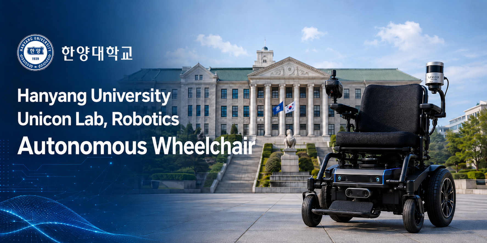

<p align="center">
  
</p>

<h1 align="center">Unicon Lab Autonomous Wheelchair</h1>

<p align="center">
  Hanyang University · Unicon Lab, Robotics<br />
  A fail-closed ROS 1 Noetic stack for map-based localization, corridor-bounded route
  following, and independent motion-safety supervision on a real powered wheelchair.
</p>

<p align="center">
  <a href="http://wiki.ros.org/noetic"></a>
  <a href="https://releases.ubuntu.com/20.04/"></a>
  
  
  
  <a href="LICENSE"></a>
</p>

<p align="center">
  <a href="#two-stacks-in-one-repository">Two stacks</a> ·
  <a href="#what-has-been-driven">Field results</a> ·
  <a href="#the-vehicle">Vehicle</a> ·
  <a href="#routes-and-the-safety-band">Routes and band</a> ·
  <a href="#command-path">Command path</a> ·
  <a href="#running-it">Running it</a> ·
  <a href="#verification">Verification</a> ·
  <a href="#safety-boundary">Safety boundary</a>
</p>

> [!IMPORTANT]
> The chair drives itself, and only with an operator aboard holding the joystick. Moving the
> joystick drops the base out of auto mode and the follower holds within one control cycle.
> No unsupervised operation and no passenger transport is authorized; every gate in
> [`contracts/wp0/A16-release-authority.yaml`](contracts/wp0/A16-release-authority.yaml)
> remains unapproved and no field result below changes that.

## Two stacks in one repository

Not knowing this costs hours, so it comes first.

| | `src/static_livox_localization/` | `src/wheelchair_*/` |
| --- | --- | --- |
| Status | **Drives the chair** | Designed architecture, not deployed |
| Localization | FAST-LIO odometry + GICP against a prior map | Adapter, confidence guard, topology guard |
| Command owner | `waypoint_follower.py` | `move_base` |
| Deployed by `tools/push_to_nuc.sh` | Yes | No |
| Frozen WP0 contracts | Not bound to them | Bound and hash-checked |

The `wheelchair_*` packages hold the contract and guard design and most of the test suite. The
`static_livox_localization` package grew in the field against a real chair on a real campus
footpath, and it is the one on the vehicle. Both are maintained; only the second moves wheels.

## What has been driven

Two complete autonomous runs of the 0727 route on **2026-07-31**, three recorded sessions on
**2026-08-02**. Localization was the open question and is now closed.

| Measured while driving, both 07-31 runs pooled | Value | Gate |
| --- | --- | --- |
| Samples | 154 | — |
| Tracking state | `TRACKING` for every one | — |
| `inlier_ratio` | 0.9666 – 1.0000 (mean 0.9949) | > 0.20 |
| `fitness` | 0.0137 – 0.0329 (mean 0.0219) | < 0.28 |
| Localization holds, published or suppressed | 0 | — |

Both runs initialized with **no manual seed**, reaching `TRACKING` through
`WAITING_INITIALIZATION` → `VERIFYING`, with FAST-LIO stationary drift of 0.016 m and 0.014 m
against a 0.15 m health limit. The two runs agree to within 0.0006 on both means, which is what
makes this a measurement and not one lucky lap. The same gates were set from 07-29 figures where
the inlier ratio ran 0.44 – 0.79; the worst 07-31 sample beats that day's best on the same route
and map. The 08-02 sessions held `TRACKING` throughout as well.

One excursion is recorded rather than smoothed over. Parked at the goal twenty minutes after the
second run ended, the fix fell to inlier 0.124 – 0.262 and crossed the gate four times with
fitness still inside its ceiling. Nothing was driving. It is the only time all evening the fix
came near failing, so the end of that route is its weakest geometry.

Recordings live in [`blackbox/`](blackbox/) under Git LFS with per-session manifests, verified by
`tests/test_blackbox_archive.py`. A truncated bag opens fine and plays short, which is the failure
that check exists for.

## The vehicle

A powered wheelchair with a Livox MID-360 on the front of the left armrest.

| Measurement | Value | Source |
| --- | --- | --- |
| Sensor forward of the wheel axle | 0.500 m | Operator measurement, 2026-07-31 |
| Sensor left of the wheel axle | 0.200 m | Operator measurement, 2026-07-31 |
| Sensor height above ground | 0.725 m | Operator measurement; the 0727 map independently gives 0.775 m ± 0.018 |
| Ground-blind radius | ~5.9 m | `0.725 / tan(7°)`, from the MID-360's lower field of view |
| Chair half width | 0.35 m | Used to inset the drawn corridor |

That blind radius is the reason drop safety cannot come from the live scan: kerbs and drop-offs
sit inside it. The scan is used for what the sensor can see - obstacles and people - and the
ground is handled by the band described below.

Frames follow REP-103 in
[`wheelchair_hardware.urdf.xacro`](src/wheelchair_description/urdf/wheelchair_hardware.urdf.xacro):
`base_footprint` at the axle midpoint on the ground, `imu_link`/`body` at FAST-LIO's IMU origin,
and `lidar_link` derived from it through the built-in extrinsic. One physical mount, one number
each, pinned across every consumer by `tests/test_mount_geometry.py` - written after that height
lived in six files as an unmeasured 0.30 m placeholder, which silently hid everything shorter
than 57 cm from the obstacle guard.

## Routes and the safety band

A route is the centreline; the band is the lateral limit at each station. The follower is
constrained by the band, not merely advised by it.

| | `20260727_chair_centred_*` | `20260812_route_v6_v8_*` | `map_by_algorithm_*` |
| --- | --- | --- | --- |
| Waypoints | 1,446 (0.2 m) | 1,900 (0.2 m) | 1,897 (0.2 m) |
| Length | 383.4 m | 379.2 m | 376.2 m |
| Band stations | 381 at 1.0 m | 761 at 0.5 m | 1,897 at 0.2 m |
| Origin | Resampled from a recorded drive | v6 preferred line smoothed inside the v8 drivable mask | Start/goal search inside a dense-map measured curb corridor |
| Shipped by the bringup | No | **Yes** | No - reviewed promotion candidate |
| Localization validated on it | **Yes** (07-31) | Not yet | Not yet |

The v6/v8 route preserves the preferred v6 line while treating the complete v8 map as a hard
drivable boundary. Route contents, band, mask image and mask geometry metadata are hash-bound,
and the route is smoothed before resampling so raster steps do not command alternating steering.

The independently generated `map_by_algorithm` route passed bilateral centre, wheel-line and
rotated full-footprint audits against dense-map measured curb boundaries, but it is not bound to
the runtime launch or deployment scripts. It must not silently replace the shipped v6/v8 route.
The two OMO implementation lines, commit provenance, algorithms, evidence and promotion gates are
recorded in
[`docs/route-implementation-status-ko.md`](docs/route-implementation-status-ko.md).

> [!WARNING]
> **Most shipped-band edges are drawn, not measured.** Every one of the 0727 band's 762 edges
> carried a measured verdict - `step_up` 266, `drop` 203, `lip` 104, `open` 177, `unscanned` 12.
> The v6/v8 rebuild retains measured v6 edge semantics at the nearest stations but otherwise
> relies on the operator-drawn v8 boundary. This remains a load-bearing assumption that requires
> re-measurement before passenger operation.

Where both exist, the drawing only ever narrows. `safety_band.corridor_limit` takes a `min()`
against the measured limit, insets the chair half width because the corridor was drawn for the
chair rather than for the point it turns about, and never lets the corridor term go negative on
the driven line - a drawing that excludes the path someone actually drove is a drawing error.
Written into `left_corridor_m` / `right_corridor_m` rather than over `left_m`, because telling
the speed policy that a 2.45 m kerb is 0.80 m away would pace the whole route for a fall that
was never near.

## Command path

Deliberately narrow, each stage able to stop the chair when the one above it misbehaves:

```text
waypoint_follower.py     route following, band containment, obstacle policy
  -> /cmd_vel_raw
safety_gate.py           independent stopping envelope and swept footprint
  -> /cmd_vel_gated
tip_guard.py             rate limiter and staleness fail-safe, last stage
  -> /cmd_vel
wheel_cmd / uart         UART-level watchdog
```

If the follower dies the gate stops the chair; if the gate dies, tip_guard's staleness check
does; if that dies, the UART watchdog does.

### Obstacle policy

`obstacle_clusters.py` clusters the accumulated scan, excludes the rider by an explicit box, and
tracks each object **in the odom frame** - whether something is moving is only a question in a
frame that does not move with the chair. The follower then answers two situations differently:

- **Watched standing still** → driven around, decided 5 m out so the chair drifts past instead of
  arriving and stopping. Every sidestep is vetted against the band.
- **Moving, or not yet watched long enough** → waited out where it stands, resuming on its own
  once the corridor clears, with no timer to reset. Stepping around a person is a manoeuvre into
  where they are about to be.

Distance to an object is measured from **its own returns**, sliced laterally, not from its
bounding box. On 2026-07-31 a wall crossing the scan diagonally was published as a box whose near
face read 0.69 m dead ahead while its nearest return inside the corridor was 2.13 m; 0.69 m sits
inside the 0.9 m floor on the stop radius, and a stopped chair's envelope stays at that floor, so
nothing could ever move a static object out of a distance it was never at. Sixteen minutes of
hold on evidence that did not exist. `cluster_guard.profile_reach` is the fix and
`test_object_profile.py` reconstructs that wall from the recorded box to pin both numbers.

### Diagnostic mode

`SAFETY_POLICIES=false` switches off everything that is a judgement about the world - band
containment, the raw corridor scan, the localization hold, the geofence, the slope limit - so one
run can measure one thing without another guard ending the measurement first and looking, from
outside a stationary chair, exactly like the thing it was meant to detect.

What never switches off is the joystick override and what it rests on: `MANUAL_MODE` is the
override and `BASE_STALE` is whether the channel reporting it is still alive. Suppressed policies
are still evaluated and published as `WOULD_HOLD:` on `/waypoint_follower/status`, because that
run is the only place their thresholds can be calibrated against the real thing.

## Running it

Deploy from a checkout with the map volume attached:

```bash
./tools/push_to_nuc.sh /Volumes/<map-volume>/merged_0707_0725_v1
```

It verifies the map bundle byte for byte, syncs and builds the workspace with whichever catkin
tool owns the build space, and installs the field scripts with checksum verification. Those
scripts live in `$HOME` outside the checkout, which is how a stale copy once kept launching the
previous week's route.

At the chair:

```bash
./trial_0727.sh    # brings the stack up, leaves the follower PAUSED
./go.sh            # starts the drive
./stop.sh          # stops it, as does moving the joystick
```

`go.sh` refuses rather than starts if the follower is absent, the object tracker is silent, or
localization is not `TRACKING`, and it checks all three before commanding anything - a check
placed after the first command runs while the chair is already moving. `stop.sh` checks nothing,
because a stop that refuses on a failed precondition is not a stop.

A black box records pose, diagnostics, commands, wheel status, follower state and the object
summary for the whole session. See [`docs/debug_bags.md`](docs/debug_bags.md).

## Verification

```bash
python3 -m pytest -q                               # host suite
python3 scripts/validate_wp0_contracts.py --root .  # frozen WP0 contracts
```

Pinned Ubuntu 20.04 / Noetic:

```bash
docker build -f tools/noetic/Dockerfile -t wheelchair-noetic-validation .
docker run --rm --network none wheelchair-noetic-validation bash -lc \
  'source /opt/ros/noetic/setup.bash && catkin_make && catkin_make run_tests && python3 -m pytest -q'
```

About 700 host tests pass. A handful of suites are evidence-bound and fail without the external
dataset - a missing GLIM artifact or full-bag record stays blocked rather than being replaced by
a simulated claim.

The tests worth reading are the ones written against something that actually went wrong:

| Test | Written because |
| --- | --- |
| `test_mount_geometry.py` | One sensor height lived in six files as a placeholder |
| `test_localization_field_envelope.py` | Gates must sit outside the measured envelope, both ways |
| `test_object_profile.py`, `test_cluster_guard.py` | A bounding-box corner is not an obstacle |
| `test_drive_policy.py` | The joystick override must survive every switched-off policy |
| `test_route_corridor.py`, `test_route_v4.py`, `test_route_v5.py` | A drawn corridor may narrow but never widen |
| `test_blackbox_archive.py` | A recording nobody can repeat, and truncation that reads as valid |

## Repository layout

```text
src/
├── static_livox_localization/   # THE DEPLOYED STACK: FAST-LIO + GICP localization, follower,
│                                #   safety gate, tip guard, clustering, field scripts
├── wheelchair_interfaces/       # frozen ROS messages, actions, and ABI contracts
├── wheelchair_perception/       # canonical sensor products; no motion permission
├── wheelchair_navigation/       # localizer adapter, route manager, move_base integration
├── wheelchair_route_safety/     # independent route and geofence authority
├── wheelchair_decision/         # deterministic mission FSM and ExecuteRoute action
├── wheelchair_safety/           # gate plus collision/slope/localization/topology authorities
├── wheelchair_hardware/         # exact driver contract; disabled by default
├── wheelchair_bringup/          # explicit sim/replay/shadow/hardware profiles
├── wheelchair_description/      # Gazebo and NUC-derived URDFs, not interchangeable
└── wheelchair_gazebo/           # simulation-only scenarios and evidence collectors
```

| Path | Purpose |
| --- | --- |
| `routes/` | Route waypoints, safety bands, corridor masks and previews |
| `blackbox/` | Field recordings (Git LFS) with per-session manifests |
| `contracts/wp0/` | Frozen ownership, schema, evidence, hazard, and authority contracts |
| `data/` | Committed candidate map, metadata, and directional routes |
| `tools/` | Deployment, field startup, route and band generation, offline analysis |
| `docs/` | Operator, mapping, interfaces, simulator, safety, and field reports |

`wheelchair_description` keeps two non-interchangeable entry points: the Gazebo-only
`wheelchair.urdf.xacro` and the NUC-derived `wheelchair_hardware.urdf.xacro`. Hardware launch and
calibration must never fall back to the simulation description.

## Safety boundary

Field operation to date is **supervised**: an operator rides the chair with a hand on the
joystick for the whole run, on a known route, on a campus footpath, with no passenger other than
the operator. That is the only mode any result here supports.

The formal release gates are unchanged and remain unapproved:

```yaml
software_release_candidate_authorized: false
hardware_motion_authorized: false
passenger_operation_authorized: false
campus_operation_authorized: false
physical_authority: false
```

They stay false while any of these is unknown or unmeasured: the exact real-driver topic, type,
MD5, sign, units, rate, timeout, mode and watchdog behaviour; physical e-stop and joystick
priority and latency; footprint, payload, battery, surface, braking and stopping envelope;
fingerprinted target-NUC resource, thermal and endurance qualification; inert HIL repetitions and
segregated closed-course no-passenger evidence; surveyed route, corridor and exclusions with
written campus approval; and a separately reviewed passenger-operation protocol.

Known open items, kept here rather than in a tracker nobody reads:

- Most shipped v6/v8 band edges still lack measured drop semantics (see the warning above).
- The localization envelope was measured on the 0727 route; v6/v8 has not been re-measured.
- Live target-NUC shadow QA is required before this route is eligible for a field start.

See [`contracts/wp0/A16-release-authority.yaml`](contracts/wp0/A16-release-authority.yaml),
[`contracts/wp0/A14-hazard-log.yaml`](contracts/wp0/A14-hazard-log.yaml), and
[`docs/safety_case.md`](docs/safety_case.md) for the complete claim boundary.

## Documentation

- [Operator runbook](docs/operator_runbook.md)
- [2026-08-02 field report](docs/2026-08-02-field-report.md)
- [Debug and black-box bags](docs/debug_bags.md)
- [Replay and offline mapping](docs/replay_and_mapping.md)
- [Interfaces and ownership](docs/interfaces.md)
- [Simulator fidelity](docs/simulator_fidelity.md)
- [Safety case](docs/safety_case.md)

## License

Apache License 2.0. See [LICENSE](LICENSE).
