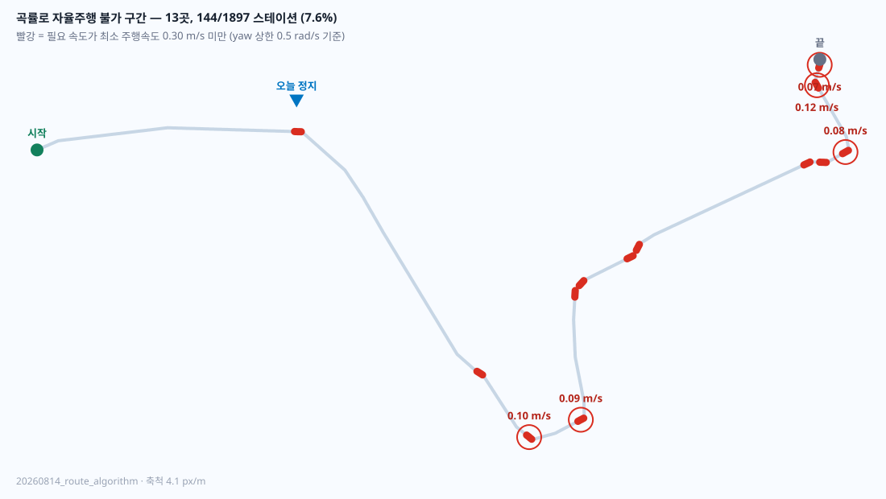

# 2026-08-15 DWA 첫 실주행 — 71 m 후 곡률로 정지

알고리즘 경로(`20260814_route_algorithm`)에서 `PROFILE=dwa`로 처음 실제 주행했습니다.
**71 m 주행 후 급커브에서 멈췄고, 스스로 회복하지 못했습니다.** 원인은 컨트롤러가
아니라 경로 곡률입니다.

블랙박스: `~/localization_trials/blackbox_20260815_185548.bag.active` (NUC, 미인덱스 —
분석 전에 `rosbag reindex` 필요)

---

## 1. 무슨 일이 있었나

```
wp 38 → 392 / 1897     222초 동안 354 스테이션 ≈ 71 m
명령 속도              평균 0.32 m/s, 최대 0.88 m/s
정지 지점              (69.3, 2.6), 밴드 스테이션 395
```

`/waypoint_follower/status` 분포 (전체 기록 3613초 중):

| 상태 | 샘플 | 비율 |
| :--- | ---: | ---: |
| `HOLD:PAUSED` | 22631 | 76.3% |
| **`HOLD:SLOWER_THAN_FLOOR`** | **3895** | **13.1%** |
| `HOLD:MANUAL_MODE` | 2348 | 7.9% |
| `DWA` (주행) | 736 | 2.5% |
| `HOLD:DWA_WAIT` | 31 | 0.1% |
| `HOLD:DWA_NO_CANDIDATE` | 15 | 0.1% |
| `HOLD:OFF_BAND` / `DWA_OFF_BAND` | 13 | 0.0% |

`SLOWER_THAN_FLOOR` 한 번이 **389초 연속**입니다. 조건이 위치에 의존하는데 위치가
안 바뀌므로 스스로 벗어날 수 없습니다.

---

## 2. 왜 멈췄나 — 곡률이 물리 하한을 뚫습니다

정지 지점에서 각 속도 제약을 따로 계산한 결과:

| 제약 | 허용 속도 |
| :--- | ---: |
| `policy_speed` (밴드 여유·경사·장애물) | 1.000 m/s |
| `corridor_speed` (15 m 앞 회랑) | 1.000 m/s |
| **`curvature_speed` (곡률 vs yaw 상한)** | **0.142 m/s** |

밴드 여유는 1.73 m로 넉넉하고 장애물도 없었습니다. **막은 것은 곡률 하나뿐입니다.**

`mpc_speed.shaped_reference`는 `limit < TURN_FLOOR_SPEED(0.30)`이면 STOP을 돌려주고,
`mpc_follower.py`의 주석이 그 이유를 정확히 적어두었습니다:

> *below about 0.22 m/s the solver settles at a standstill and reports OK while
> doing it, and below 0.30 the loaded base does not rotate. Holding is the honest
> version of both.*

```
필요 속도 0.142 m/s  <  전진 회전 하한 0.300 m/s
```

`w_max = 0.5 rad/s`를 지키려면 0.142 m/s로 돌아야 하는데, 적재된 베이스는 0.30 m/s
미만에서 회전하지 않습니다. **구조적 모순이고, 정지가 정직한 대응입니다.**

---

## 3. 이 경로 전체에 13곳 있습니다

경로 1897 스테이션 전체에 `curvature_speed`를 계산했습니다
(`docs/nuc_snapshot/curvature_profile.py`).

**144 / 1897 스테이션 (7.6%), 13개 구간이 자율 주행 불가**입니다. 전부 ~2.2 m짜리 코너.

| 스테이션 | 필요 속도 | 위치 |
| :--- | ---: | :--- |
| 1881–1892 | 0.067 m/s | (226.3, 21.7) |
| 1732–1742 | 0.079 | (233.4, −4.0) |
| 1065–1075 | 0.089 | (154.1, −84.3) |
| 979–989 | 0.105 | (138.8, −88.4) |
| 1848–1858 | 0.123 | (226.2, 15.7) |
| **392–402** | **0.142** | (69.3, 2.6) ← 오늘 정지 |
| 1261–1271 | 0.143 | (153.2, −47.0) |
| 1364–1374 | 0.156 | (168.9, −35.5) |
| 1694–1704 | 0.180 | (226.6, −6.6) |
| 1384–1394 | 0.182 | (171.7, −33.0) |
| 1669–1679 | 0.205 | (221.9, −7.4) |
| 855–865 | 0.231 | (123.9, −69.3) |

오늘 멈춘 곳은 13곳 중 6번째로 급했습니다. **계속 갔으면 7곳을 더 만났을 것입니다.**



빨간 구간이 자율 주행 불가 지점입니다. 경로 오른쪽 끝의 되돌아오는 구간과 아래쪽
꺾이는 지점에 몰려 있습니다.

---

## 4. 컨트롤러를 바꿔서 해결될 문제가 아닙니다

`curvature_speed`와 `TURN_FLOOR_SPEED`는 `mpc_speed.py`에 있고 **pursuit·MPC·DWA가
공유**합니다. MPC도 같은 자리에서 `SLOWER_THAN_FLOOR`를 냅니다.

pursuit은 이 검사를 하지 않는 대신 목표를 옆으로 밀어 대응하는데,
`start_wheelchair_localization.sh`의 주석이 그 결과를 기록하고 있습니다 —
*"put the chair at a wall three times on 2026-08-04"*. 같은 곡선들이 원인일 가능성이
높습니다.

**즉 DWA는 이 경로의 문제를 드러낸 것이지 만든 것이 아닙니다.**

---

## 5. 제자리 회전으로 우회하려 했으나 — 드라이버가 막습니다

급커브를 "서서 돌고 다시 직진"으로 통과하는 방안을 검토했습니다. 실측 결과
**현재 드라이버에서는 제자리 회전이 불가능합니다.**

`base_model/src/wheel_cmd_tmp.py`의 `compute_wheel_command`:

```python
if abs(angular_z) > YAW_DEADBAND_RAD_S:
    boost = min(max(TURN_AUTHORITY_KMH - fastest, 0.0), max(headroom, 0.0))
    left  += boost      # 양 바퀴에 같은 값
    right += boost
```

주석대로 *"only the forward speed rises"* — `linear.x=0, angular.z=w`를 보내도 드라이버가
전진 속도를 강제로 올립니다. 실제로 `w`를 0.10부터 0.45까지 올려가며 시험한 결과
**호를 그리며 나갔고 제자리 회전은 없었습니다.** 실측 각속도도 지령의 1/6~1/10이었습니다.

추가로 `linear_x < 0.0`이 거부되므로 한쪽 바퀴 역회전도 불가합니다. `encode()`는
후진 방향(`87`)을 지원하므로 **하드웨어가 아니라 이 파이썬 정책 한 겹이 막고 있습니다.**

---

## 6. 결론과 다음 단계

**경로를 다시 그리는 것이 맞습니다.** 곡률 상한을 걸어야 합니다:

```
필요 조건:  curvature ≤ w_max / TURN_FLOOR_SPEED = 0.5 / 0.3 = 1.67 rad/m
            즉 최소 회전 반경 0.6 m
```

`tools/build_preferred_mask_route.py`는 Savitzky–Golay 평활화만 하고 **결과 곡률을
검사하지 않습니다.** 그래서 이런 코너가 남습니다. 생성 파이프라인에 곡률 게이트를
넣는 것이 근본 해결입니다:

```
마스크 → build_preferred_mask_route.py → curvature 검사(게이트) → promote_algorithm_route.py
```

은교가 그린 v6(preferred) / v7(drivable) / v8(합본) 기반으로 재생성 예정입니다.
v5 계열에서는 정지가 없었다는 현장 보고가 있어, 이 곡률 문제는 알고리즘 경로 승격과
함께 들어온 것으로 보입니다.

---

## 7. 부수적으로 확인된 것

- **휠체어를 손으로 뒤로 밀면** follower의 윈도우 탐색이 발산합니다:
  `position diverged from windowed search (wp 157, 2.4m) vs global nearest (wp 145, 0.3m)`.
  매번 전역 최근접으로 재동기화하며 따라옵니다. 동시에 측위가
  `pose step clamped: 0.22 m withheld over 0.10 s`로 손으로 민 속도를 억제합니다.
  둘 다 정상 동작이지만, 수동 이동 후에는 상태가 잠시 흔들립니다.
- `AUTO_INIT_GLOBAL_ONLY=false`로 known-start 시드를 쓰면 **약 16초**에 TRACKING에
  도달합니다. 전역 탐색은 180초 예산을 다 쓰고 MANUAL_ALIGN으로 떨어졌습니다.
- NUC의 `20260814_route_algorithm_safety_band.json`과 `route_2d_map_algorithm.pgm`이
  저장소 버전과 달라 `asset_binding` 검증이 실패하고 있었습니다. follower가
  `ROSInitException`으로 죽는데 **스택은 READY까지 진행**하므로 겉으로는 정상으로
  보입니다. 저장소 버전으로 복원했습니다(NUC에 `~/band_backup_*`, `~/maskbak_*` 백업).
